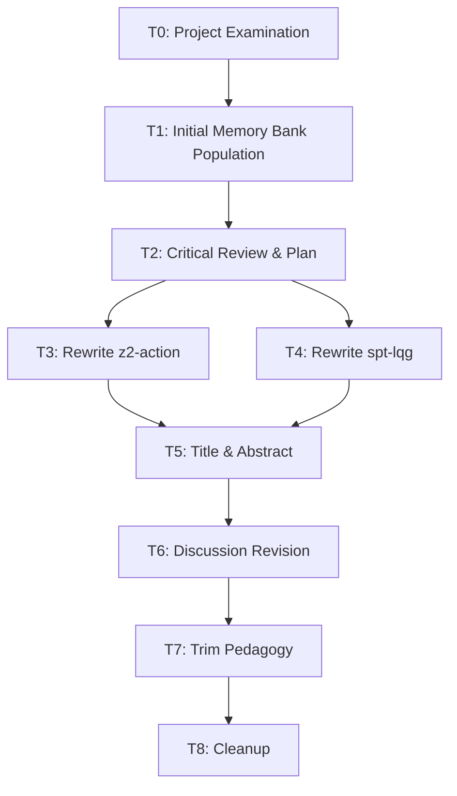

# Task Registry
*Last Updated: 2026-04-18 02:12:39 IST*

## Active Tasks
| ID | Title | Status | Priority | Started | Dependencies | Owner | Details |
|----|-------|--------|----------|---------|--------------|-------|---------|
| T7 | Trim MPS Pedagogy and Appendices | 🔄 IN PROGRESS | MEDIUM | 2026-04-16 | - | Assistant | [Details](tasks/T7.md) |
| T10 | Fix 17 Bibliography Metadata Errors | ⬜ NOT STARTED | HIGH | - | - | Assistant | [Details](tasks/T10.md) |
| T11 | Fix Critical Manuscript Errors | ⬜ NOT STARTED | CRITICAL | - | - | Assistant | [Details](tasks/T11.md) |
| T12 | Address Major Issues and Add Recent Citations | ⬜ NOT STARTED | HIGH | - | T11 | Assistant | [Details](tasks/T12.md) |

## Task Details

### T3: Rewrite z2-action-derivation.tex
**Description**: Completely rewrote Section 7 with four subsections: Z2 field definition, effective action, phase structure (Elitzur remark), and cosmological transition (QECC).
**Status**: ✅ COMPLETED
**Last Active**: 2026-04-16 23:00:00 IST
**Completion Criteria**:
- [x] Define Z2 gauge field on edges
- [x] Derive Ising gauge effective action
- [x] Analyze phases with Wilson loop
- [x] Address Elitzur's theorem

**Related Files**:
- `z2-action-derivation.tex`
- `timesarrow.tex`

### T4: Rewrite spt-lqg-mapping.tex
**Description**: Expanded Section 6 with four subsections: CZX structural correspondence, j=1/2 dominance, SPT=deconfined identification, and edge modes conjecture.
**Status**: ✅ COMPLETED
**Last Active**: 2026-04-16 23:00:00 IST
**Completion Criteria**:
- [x] CZX-to-intertwiner mapping
- [x] j=1/2 justification
- [x] SPT=deconfined phase
- [x] Edge modes conjecture

**Related Files**:
- `spt-lqg-mapping.tex`
- `timesarrow.tex`

### T5: Update Title and Abstract
**Description**: Changed title to emphasize confinement-deconfinement and rewrote abstract for technical completeness.
**Status**: ✅ COMPLETED
**Last Active**: 2026-04-16 23:05:00 IST
**Completion Criteria**:
- [x] New title integrated
- [x] Abstract fully rewritten

**Related Files**:
- `timesarrow.tex`

### T6: Revise Discussion Section
**Description**: Added new subsections on Elitzur's Theorem, QECC stability, and Hopf algebraic perspectives.
**Status**: ✅ COMPLETED
**Last Active**: 2026-04-16 23:10:00 IST
**Completion Criteria**:
- [x] Elitzur's Theorem sub-section
- [x] QECC stability sub-section
- [x] Hopf algebras sub-section

**Related Files**:
- `timesarrow.tex`

### T7: Trim MPS Pedagogy and Appendices
**Description**: Cut Sec 3 by ~50% (move pedagogy to appendix or cite Bridgeman-Chubb). Shorten Appendix D.
**Status**: 🔄 IN PROGRESS
**Last Active**: 2026-04-16 23:25:00 IST
**Completion Criteria**:
- [ ] Section 3 reduced to core elements
- [ ] Appendix D condensed

**Related Files**:
- `timesarrow.tex`

### T8: Fix Typos and Cleanup
**Description**: Full PDF review + 10 typo/structural fixes; removed visible margin todonote; fixed broken fig:czx-entangled ref; fixed duplicate todonotes package.
**Status**: ✅ COMPLETED
**Last Active**: 2026-04-17 02:29:00 IST
**Related Files**: `timesarrow.tex`, `timesarrow.bib`

### T9: Create Missing Figure (Sec 3.5)
**Description**: TikZ figure showing M/M⁻¹ insertion on 2D TNS subregion; interior cancellation; boundary survival. Replaced \todo in Sec 3.5.
**Status**: ✅ COMPLETED
**Last Active**: 2026-04-17 02:29:00 IST
**Related Files**: `figures/tns-matrix-insertion-2d.tex`, `timesarrow.tex`

### T10: Fix 17 Bibliography Metadata Errors
**Description**: Fix 17 bib entries from Agent A audit: wrong journal (Markopoulou2000Quantum), wrong year (Vidal2003), missing journals (Wen2002a, Han2016), deprecated preprint types (Barbour2013A), and DOI/arXiv additions.
**Status**: ⬜ NOT STARTED
**Last Active**: —
**Related Files**: `timesarrow.bib`

### T11: Fix Critical Manuscript Errors
**Description**: Five publication-blocking errors from Agent C: "We" glyph corruption in ~10 equations, D_e = j(j+1) wrong formula, Ψ₁/Ψ₂ internal inconsistency (crux derivation), det scaling muddled, gauge invariance unshown.
**Status**: ⬜ NOT STARTED
**Last Active**: —
**Related Files**: `timesarrow.tex`, `spt-lqg-mapping.tex`, `z2-action-derivation.tex`

### T12: Address Major Issues and Add Recent Citations
**Description**: 9 major issues (Agent C) + ~20 recent citations 2018–2026 (Agent B). Includes fixing "first order in 3+1d" factual error, CZX global/local Z₂ conflation, SSB language leak, j=1/2 overstatement, and adding must-cite recent papers.
**Status**: ⬜ NOT STARTED
**Last Active**: —
**Dependencies**: T11
**Related Files**: `timesarrow.tex`, `spt-lqg-mapping.tex`, `z2-action-derivation.tex`, `timesarrow.bib`

## Completed Tasks
| ID | Title | Completed | Related Tasks | Archive |
|----|-------|-----------|---------------|---------|
| T0 | Project Examination | 2026-04-16 | - | [Details](tasks/T0.md) |
| T1 | Initial Memory Bank Population | 2026-04-16 | - | [Details](tasks/T1.md) |
| T2 | Critical Manuscript Review & Rewrite Plan | 2026-04-16 | - | [Details](tasks/T2.md) |
| T3 | Rewrite z2-action-derivation.tex | 2026-04-16 | - | [Details](tasks/T3.md) |
| T4 | Rewrite spt-lqg-mapping.tex | 2026-04-16 | - | [Details](tasks/T4.md) |
| T5 | Update Title and Abstract | 2026-04-16 | - | [Details](tasks/T5.md) |
| T6 | Revise Discussion Section | 2026-04-16 | - | [Details](tasks/T6.md) |
| T8 | Fix Typos and Cleanup | 2026-04-17 | T9 | [Details](tasks/T8.md) |
| T9 | Create Missing Figure (Sec 3.5) | 2026-04-17 | T8 | [Details](tasks/T9.md) |

## Task Relationships

