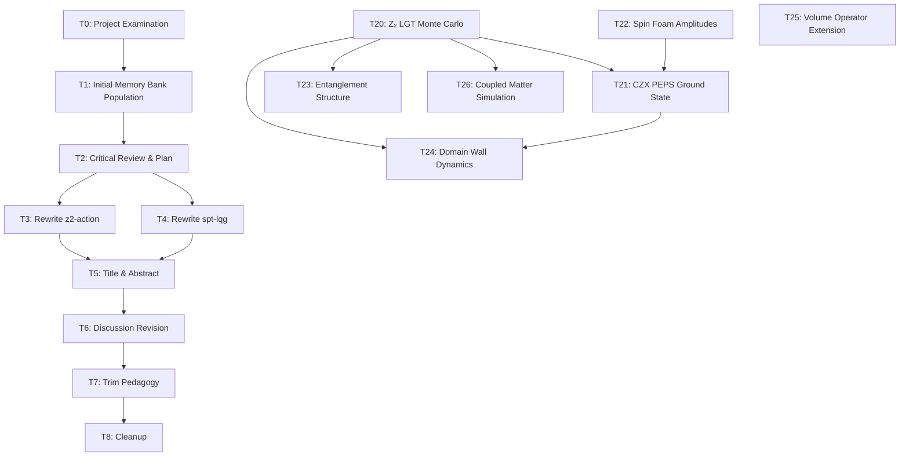

# Task Registry
*Last Updated: 2026-06-24 09:35:00 IST*

## Active Tasks
| ID | Title | Status | Priority | Started | Dependencies | Details |
|----|-------|--------|----------|---------|--------------|---------|
| T13 | Gemini 3 Flash - Create Accessible Web Presentation | 🔄 | MEDIUM | 2026-04-18 | - | [Details](tasks/T13.md) |
| T18 | Manuscript Claim-Hardening and Reviewer-Response Roadmap | 🔄 | HIGH | 2026-05-06 | T15, T17 | [Details](tasks/T18.md) |
| T20 | 3D Z₂ Lattice Gauge Theory Monte Carlo | 🔄 | CRITICAL | 2026-06-24 | — | [Details](tasks/T20.md) |
| T21 | CZX-Spin Network PEPS Ground State | 🔄 | HIGH | 2026-06-24 | T20 | [Details](tasks/T21.md) |
| T22 | Spin Foam Amplitude for j=1/2 Dominance | 🔄 | HIGH | 2026-06-24 | — | [Details](tasks/T22.md) |
| T23 | Entanglement Structure of Deconfined Phase | 🔄 | MEDIUM | 2026-06-24 | T20 | [Details](tasks/T23.md) |
| T24 | Domain Wall Dynamics and Surface Topological Order | 🔄 | MEDIUM | 2026-06-24 | T20, T21 | [Details](tasks/T24.md) |
| T25 | Volume Operator Eigenvalue Distribution (Extended) | 🔄 | LOW | 2026-06-24 | — | [Details](tasks/T25.md) |
| T26 | Coupled Spin Network + Matter Simulation | 🔄 | LOW | 2026-06-24 | T20 | [Details](tasks/T26.md) |

## Task Details

### T3: Rewrite z2-action-derivation.tex
**Description**: Completely rewrote Section 7 with four subsections: Z2 field definition, effective action, phase structure (Elitzur remark), and cosmological transition (QECC).
**Status**: ✅ COMPLETED
**Last Active**: 2026-04-16 23:00:00 IST
**Completion Criteria**:
- [x] Define Z2 gauge field on edges
- [x] Derive Ising gauge effective action
- [x] Analyze phases with Wilson loop
- [x] Address Elitzur's theorem

**Related Files**:
- `z2-action-derivation.tex`
- `timesarrow.tex`

### T4: Rewrite spt-lqg-mapping.tex
**Description**: Expanded Section 6 with four subsections: CZX structural correspondence, j=1/2 dominance, SPT=deconfined identification, and edge modes conjecture.
**Status**: ✅ COMPLETED
**Last Active**: 2026-04-16 23:00:00 IST
**Completion Criteria**:
- [x] CZX-to-intertwiner mapping
- [x] j=1/2 justification
- [x] SPT=deconfined phase
- [x] Edge modes conjecture

**Related Files**:
- `spt-lqg-mapping.tex`
- `timesarrow.tex`

### T5: Update Title and Abstract
**Description**: Changed title to emphasize confinement-deconfinement and rewrote abstract for technical completeness.
**Status**: ✅ COMPLETED
**Last Active**: 2026-04-16 23:05:00 IST
**Completion Criteria**:
- [x] New title integrated
- [x] Abstract fully rewritten

**Related Files**:
- `timesarrow.tex`

### T6: Revise Discussion Section
**Description**: Added new subsections on Elitzur's Theorem, QECC stability, and Hopf algebraic perspectives.
**Status**: ✅ COMPLETED
**Last Active**: 2026-04-16 23:10:00 IST
**Completion Criteria**:
- [x] Elitzur's Theorem sub-section
- [x] QECC stability sub-section
- [x] Hopf algebras sub-section

**Related Files**:
- `timesarrow.tex`

### T7: Trim MPS Pedagogy and Appendices
**Description**: Cut Sec 3 by ~50% (move pedagogy to appendix or cite Bridgeman-Chubb). Shorten Appendix D.
**Status**: ✅ COMPLETED
**Last Active**: 2026-04-20 IST
**Completion Criteria**:
- [x] Section 3 reduced to core elements (skip note added at line 307)
- [x] Appendix D condensed

**Related Files**:
- `timesarrow.tex`

### T8: Fix Typos and Cleanup
**Description**: Full PDF review + 10 typo/structural fixes; removed visible margin todonote; fixed broken fig:czx-entangled ref; fixed duplicate todonotes package.
**Status**: ✅ COMPLETED
**Last Active**: 2026-04-17 02:29:00 IST
**Related Files**: `timesarrow.tex`, `timesarrow.bib`

### T9: Create Missing Figure (Sec 3.5)
**Description**: TikZ figure showing M/M⁻¹ insertion on 2D TNS subregion; interior cancellation; boundary survival. Replaced \todo in Sec 3.5.
**Status**: ✅ COMPLETED
**Last Active**: 2026-04-17 02:29:00 IST
**Related Files**: `figures/tns-matrix-insertion-2d.tex`, `timesarrow.tex`

### T10: Fix 17 Bibliography Metadata Errors
**Description**: Fix 17 bib entries from Agent A audit: wrong journal (Markopoulou2000Quantum), wrong year (Vidal2003), missing journals (Wen2002a, Han2016), deprecated preprint types (Barbour2013A), and DOI/arXiv additions.
**Status**: ✅ COMPLETED
**Last Active**: 2026-04-18 04:30:37 IST
**Related Files**: `timesarrow.bib`, `timesarrow.tex`, `spt-lqg-mapping.tex`, `z2-action-derivation.tex`, `supplementary-calculations.tex`

### T15: 3D SPT Survey and Mapping
**Description**: Survey classification of 3D bosonic SPT phases with Z₂ᵀ symmetry to resolve the 2D/3D mismatch identified in M14. Match deconfined 3D Z₂ LGT to the appropriate SPT entry.
**Status**: ✅ COMPLETED
**Last Active**: 2026-04-20 12:36:54 IST
**Dependencies**: T12
**Related Files**: `memory-bank/implementation-details/3d-spt-survey-needed.md`, `memory-bank/implementation-details/3d-spt-survey-results.md`, `memory-bank/implementation-details/fermionic-matter-emergence.md`, `spt-lqg-mapping.tex`, `timesarrow.bib`

### T18: Manuscript Claim-Hardening and Reviewer-Response Roadmap
**Description**: Build a reviewer-survival memo that separates derivable manuscript claims from model assumptions, conjectures, and future-work items before any manuscript edits.
**Status**: 🔄 ACTIVE
**Last Active**: 2026-05-20 09:30:55 IST
**Dependencies**: T15, T17
**Related Files**: `memory-bank/tasks/T18.md`, `memory-bank/implementation-details/manuscript-claim-hardening-proposal-2026-05-06.md`, `memory-bank/implementation-details/ai-reviews/gpt55-peer-review-2026-05-19.md`, `memory-bank/implementation-details/ai-reviews/gpt55-response-to-kimi-comparison-2026-05-19.md`, `memory-bank/implementation-details/ai-reviews/kimi-gpt55-synthesis-2026-05-19.md`, `ai-assistance-statement.md`, `timesarrow.pdf`, `timesarrow.tex`

### T19: Markdown-First Z2 Section Pilot
**Description**: Build a non-destructive Markdown-plus-LaTeX pilot for the manuscript's `Z_2` section, verify a standalone PDF, and document the workflow before any full-manuscript integration.
**Status**: ✅ COMPLETED
**Last Active**: 2026-05-09 11:44:31 IST
**Dependencies**: T18
**Related Files**: `markdown-pilot/z2-action.md`, `markdown-pilot/generated/z2-action.tex`, `markdown-pilot/z2-pilot.tex`, `markdown-pilot/build/z2-pilot.pdf`, `memory-bank/tasks/T19.md`, `memory-bank/implementation-details/markdown-first-z2-pilot-2026-05-09.md`

## Completed Tasks
| ID | Title | Completed | Related Tasks | Archive |
|----|-------|-----------|---------------|---------|
| T0 | Project Examination | 2026-04-16 | - | [Details](tasks/T0.md) |
| T1 | Initial Memory Bank Population | 2026-04-16 | - | [Details](tasks/T1.md) |
| T2 | Critical Manuscript Review & Rewrite Plan | 2026-04-16 | - | [Details](tasks/T2.md) |
| T3 | Rewrite z2-action-derivation.tex | 2026-04-16 | - | [Details](tasks/T3.md) |
| T4 | Rewrite spt-lqg-mapping.tex | 2026-04-16 | - | [Details](tasks/T4.md) |
| T5 | Update Title and Abstract | 2026-04-16 | - | [Details](tasks/T5.md) |
| T6 | Revise Discussion Section | 2026-04-16 | - | [Details](tasks/T6.md) |
| T7 | Trim MPS Pedagogy and Appendices | 2026-04-20 | - | [Details](tasks/T7.md) |

| T8 | Fix Typos and Cleanup | 2026-04-17 | T9 | [Details](tasks/T8.md) |
| T9 | Create Missing Figure (Sec 3.5) | 2026-04-17 | T8 | [Details](tasks/T9.md) |
| T10 | Fix 17 Bibliography Metadata Errors | 2026-04-18 | - | [Details](tasks/T10.md) |
| T11 | Fix Critical Manuscript Errors | 2026-04-20 | - | [Details](tasks/T11.md) |
| T12 | Address Major Issues and Add Recent Citations | 2026-04-20 | T11 | [Details](tasks/T12.md) |
| T15 | 3D SPT Survey and Mapping | 2026-04-20 | T12 | [Details](tasks/T15.md) |
| T14 | Kimi K2.5 - Minimal Web Presentation | 2026-04-29 | T13 | [Details](tasks/T14.md) |
| T16 | Submission Documentation | 2026-04-29 | T15 | [Details](tasks/T16.md) |
| T17 | arXiv Submission Preparation | 2026-05-05 | T16 | [Details](tasks/T17.md) |
| T19 | Markdown-First Z2 Section Pilot | 2026-05-09 | T18 | [Details](tasks/T19.md) |

## Task Relationships

