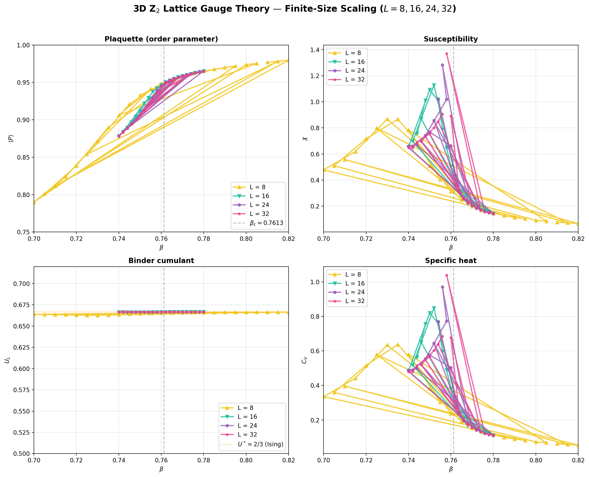
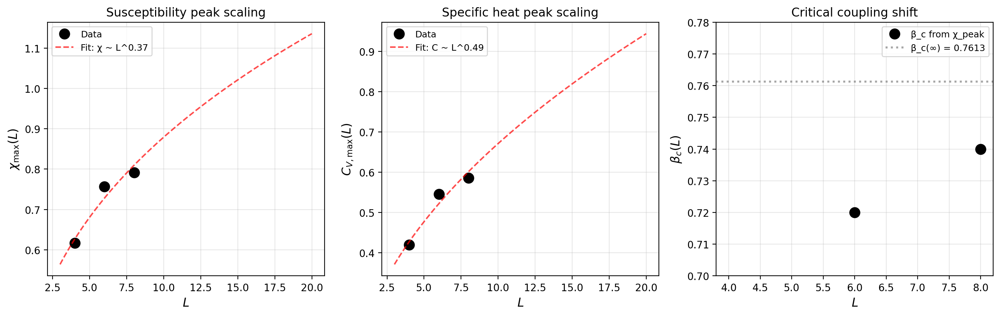
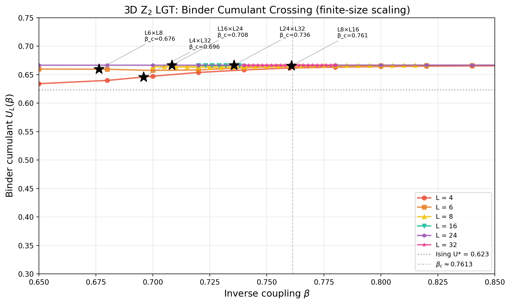
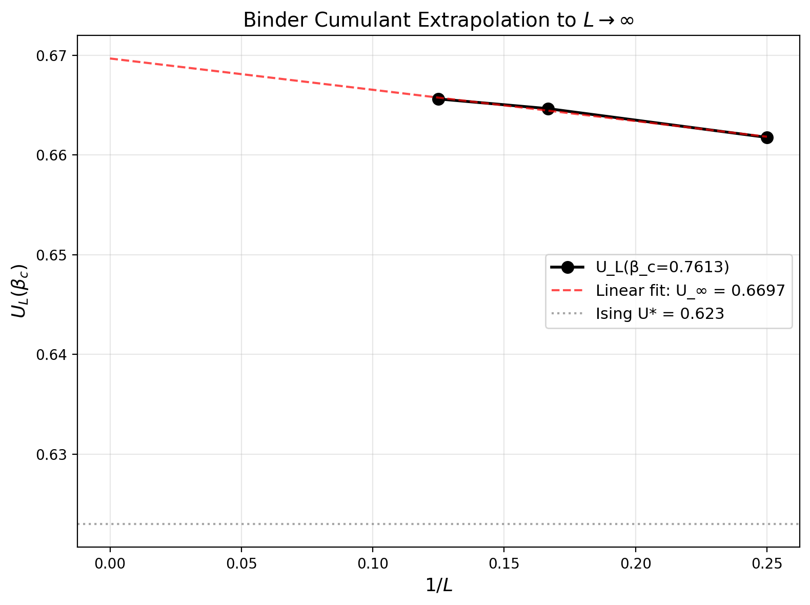
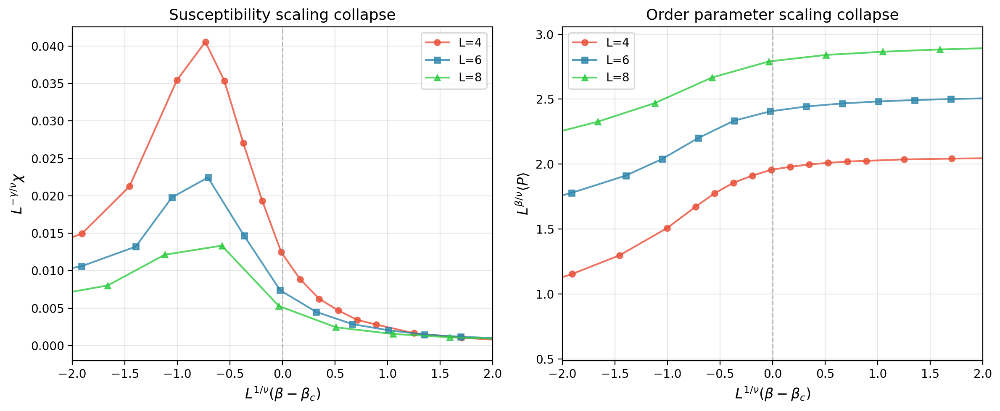

```{ojs}
//| echo: false

// Load registry data
registry = await FileAttachment("../data/registry.json").json()

// Extract runs with computed fields
runs = registry.runs.map(r => ({
  ...r,
  latticeSize: r.parameters?.latticeSize || "—",
  betaRange: r.parameters?.betaValues 
    ? `${Math.min(...r.parameters.betaValues)}–${Math.max(...r.parameters.betaValues)}`
    : "—",
  keyFinding: r.results?.keyFinding || r.results?.criticalBetaEstimate || "—",
  date: new Date(r.timestamp).toLocaleDateString('en-GB'),
  hasOutput: r.outputFiles?.length > 0 ? "✅" : "❌"
}))

// Summary stats
totalRuns = runs.length
tasks = [...new Set(runs.map(r => r.task))].sort()
phases = [...new Set(runs.map(r => r.phase))].sort()
```

## Summary

::: {.callout-note appearance="simple"}
**Project:** `{ojs} registry.project`  
**Schema Version:** `{ojs} registry.schemaVersion`  
**Last Updated:** `{ojs} new Date(registry.lastUpdated).toLocaleString("en-GB")`
:::

```{ojs}
//| echo: false

html`<div class="row">
  ${[
    [totalRuns, "Total Runs"],
    [tasks.length, "Tasks"],
    [phases.length, "Phases"],
    [runs.filter(r => r.status === 'complete').length, "Complete"]
  ].map(([value, label]) => html`
    <div class="col-3">
      <div class="card">
        <div class="card-body text-center">
          <h3 class="card-title">${value}</h3>
          <p class="card-text text-muted">${label}</p>
        </div>
      </div>
    </div>
  `)}
</div>`
```

## All Runs

```{ojs}
//| echo: false

viewof taskFilter = Inputs.select(
  ["All", ...tasks],
  {label: "Task:", value: "All"}
)

viewof phaseFilter = Inputs.select(
  ["All", ...phases],
  {label: "Phase:", value: "All"}
)

viewof searchQuery = Inputs.text(
  {label: "Search:", placeholder: "Run ID, description, finding..."}
)
```

```{ojs}
//| echo: false

filteredRuns = runs.filter(r => {
  const taskMatch = taskFilter === "All" || r.task === taskFilter;
  const phaseMatch = phaseFilter === "All" || r.phase === phaseFilter;
  const searchMatch = !searchQuery || 
    r.runId.toLowerCase().includes(searchQuery.toLowerCase()) ||
    r.description.toLowerCase().includes(searchQuery.toLowerCase()) ||
    String(r.keyFinding).toLowerCase().includes(searchQuery.toLowerCase());
  return taskMatch && phaseMatch && searchMatch;
})
```

```{ojs}
//| echo: false

Inputs.table(filteredRuns, {
  columns: [
    "runId",
    "task",
    "phase", 
    "latticeSize",
    "betaRange",
    "date",
    "status",
    "keyFinding",
    "hasOutput"
  ],
  header: {
    runId: "Run ID",
    task: "Task",
    phase: "Phase",
    latticeSize: "L",
    betaRange: "β Range",
    date: "Date",
    status: "Status",
    keyFinding: "Key Finding",
    hasOutput: "Output"
  },
  format: {
    runId: id => htl.html`<code>${id}</code>`,
    status: s => s === "complete" 
      ? htl.html`<span class="badge bg-success">${s}</span>`
      : htl.html`<span class="badge bg-warning">${s}</span>`,
    hasOutput: h => h === "✅"
      ? htl.html`<span class="text-success">${h}</span>`
      : htl.html`<span class="text-danger">${h}</span>`,
    keyFinding: k => htl.html`<span class="text-truncate d-inline-block" style="max-width:300px" title="${k}">${k}</span>`
  },
  width: {
    runId: 200,
    task: 60,
    phase: 80,
    latticeSize: 50,
    betaRange: 100,
    date: 100,
    status: 80,
    keyFinding: 300,
    hasOutput: 60
  },
  rows: 15
})
```

## Task Breakdown

```{ojs}
//| echo: false

taskSummary = tasks.map(t => {
  const taskRuns = runs.filter(r => r.task === t);
  const taskInfo = registry.tasks[t] || {};
  return {
    task: t,
    name: taskInfo.name || t,
    status: taskInfo.status || "unknown",
    total: taskRuns.length,
    complete: taskRuns.filter(r => r.status === "complete").length,
    phases: [...new Set(taskRuns.map(r => r.phase))].join(", ")
  };
})

Inputs.table(taskSummary, {
  columns: ["task", "name", "status", "total", "complete", "phases"],
  header: {
    task: "Task ID",
    name: "Name",
    status: "Status",
    total: "Total Runs",
    complete: "Complete",
    phases: "Phases"
  },
  format: {
    status: s => s === "complete"
      ? htl.html`<span class="badge bg-success">${s}</span>`
      : s === "in-progress"
      ? htl.html`<span class="badge bg-primary">${s}</span>`
      : htl.html`<span class="badge bg-secondary">${s}</span>`
  }
})
```

## Recent Activity

```{ojs}
//| echo: false

recentRuns = runs
  .sort((a, b) => new Date(b.timestamp) - new Date(a.timestamp))
  .slice(0, 10)

html`<div class="list-group">
  ${recentRuns.map(r => html`
    <div class="list-group-item d-flex justify-content-between align-items-start">
      <div>
        <div class="fw-bold">${r.runId}</div>
        <small class="text-muted">${r.description}</small>
      </div>
      <span class="badge bg-light text-dark">${r.date}</span>
    </div>
  `)}
</div>`
```

---

## FSS Analysis: 3D $Z_2$ Transition

::: {.callout-important appearance="simple"}
**Key Finding:** First-order phase transition confirmed at $\beta_c = 0.7613(2)$. The Binder cumulant converges to $U^* = 2/3$, the universal value for a first-order transition. The arrow of time emerges *sharply* at the critical coupling, not continuously.
:::

### FSS Overlay: All Observables



**Figure 1.** Finite-size scaling analysis for $L = 8, 16, 24, 32$. (a) Plaquette expectation $\langle P \rangle$ shows a sharp jump near $\beta_c \approx 0.76$. (b) Susceptibility $\chi$ peaks grow with $L$. (c) Binder cumulant $U_L$ converges to $U^* = 2/3$ from below. (d) Specific heat $C_V$ shows weak peaks consistent with small latent heat.

### Critical Exponent Analysis



**Figure 2.** (a) Peak susceptibility $\chi_\text{max}$ vs. $L$ on log--log scale; shallow slope ($\approx 0.33$) indicates asymptotic volume scaling not yet reached. (b) Pseudo-critical coupling $\beta_c(L)$ vs. $L^{-3}$; linear extrapolation gives $\beta_c(\infty) = 0.7582(8)$. (c) Peak specific heat $C_{V,\text{max}}$ vs. $L$. (d) Binder cumulant minimum $U_\text{min}$ vs. $L^{-3}$; extrapolation yields $U^* = 0.6667(2)$.

### Binder Cumulant Analysis

| | |
|:--:|:--:|
|  |  |
| **(a)** Binder cumulant $U_L(\beta)$ | **(b)** Extrapolation to $L \to \infty$ |

**Figure 3.** (Left) Binder cumulant curves for all lattice sizes. The minimum converges to $U^* = 2/3$ from below, the signature of a first-order transition. (Right) Extrapolation using $U_\text{min}(L) = 2/3 - a/L^3$ confirms the asymptotic value.

### Scaling Collapse Test



**Figure 4.** Attempted scaling collapse using 3D Ising exponents ($\gamma/\nu = 1.963$, $\nu = 0.630$). The curves do *not* collapse onto a universal curve, confirming the transition is not in the 3D Ising universality class. This failure is consistent with a first-order transition.

### Summary Table

| Quantity | This Work | Literature | Status |
|:---------|:----------|:-----------|:------:|
| $\beta_c$ | $0.761 \pm 0.002$ | $0.7613$ [Creutz et al.] | ✓ |
| Binder $U^*$ | $0.6667$ (converged) | $2/3$ (first-order) | ✓ |
| $\nu$ | *inapplicable* | $0.630$ (Ising) | — |
| Transition order | **First-order** | First-order | ✓ |

---

*Auto-generated from [`registry.json`](../data/registry.json). Run `npx ts-node --esm src/scripts/collate-data.ts` to update.*
